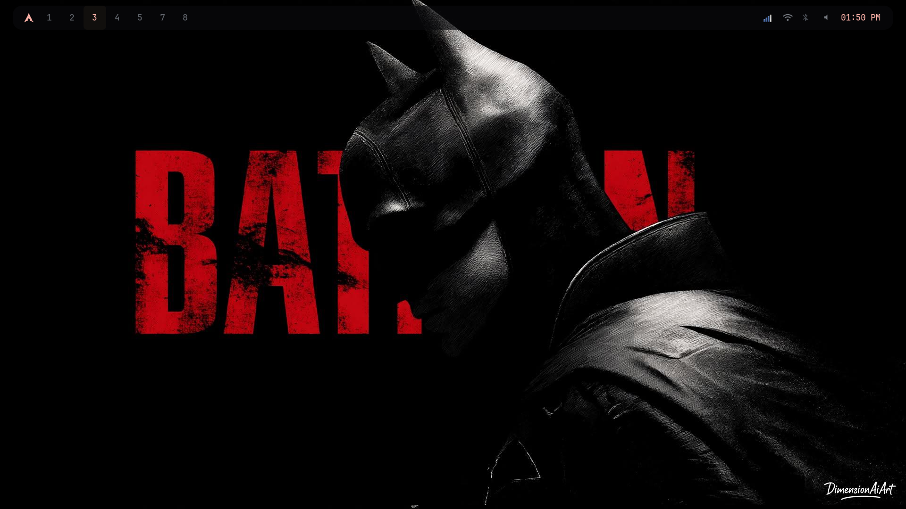
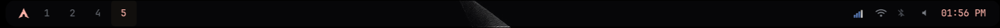
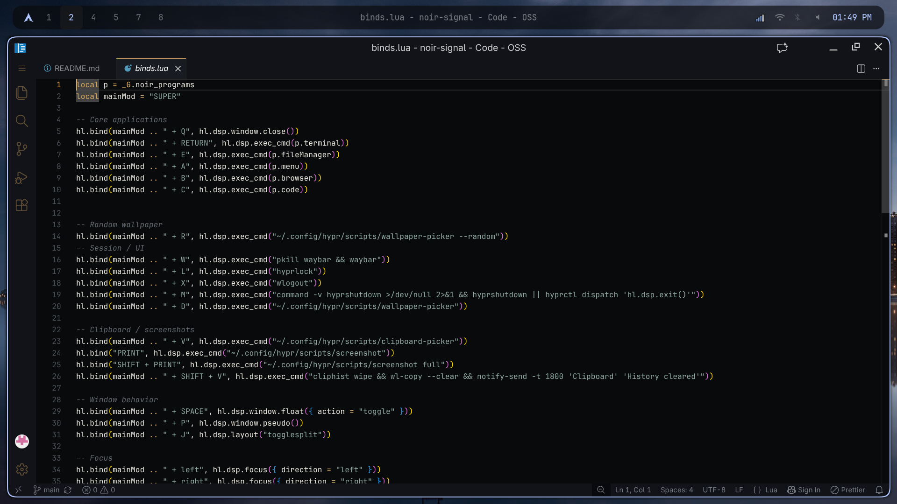
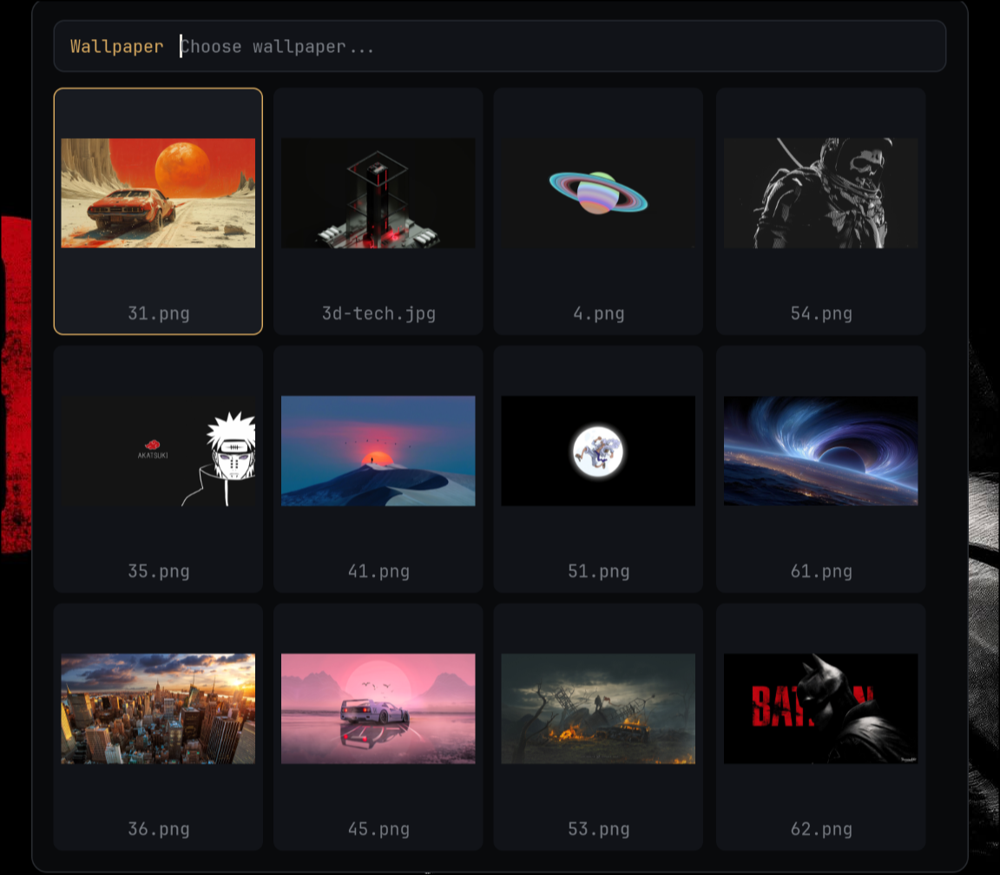
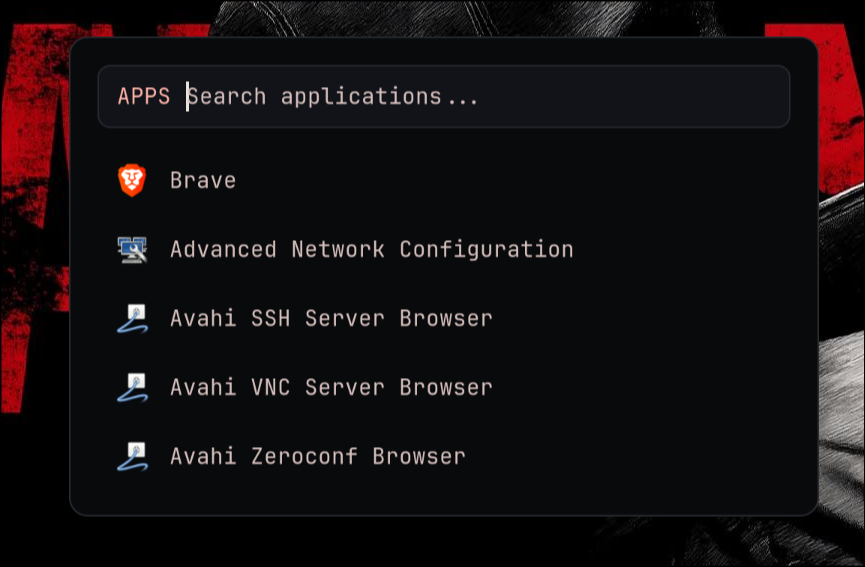
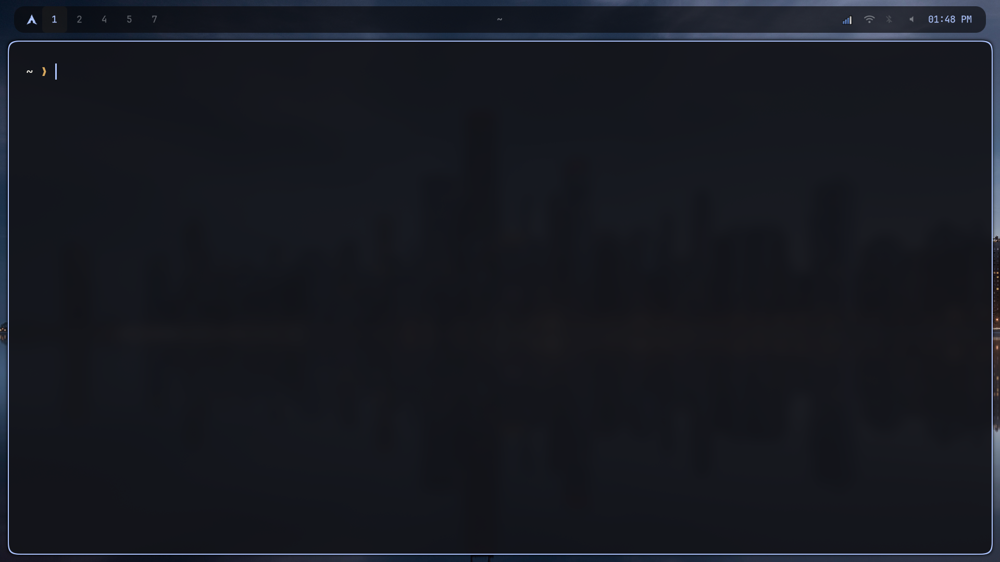

# NOIR SIGNAL

### A dark cinematic Hyprland rice.

**Quiet UI. Warm signal. Zero clutter.**

Built from scratch for Arch Linux + Hyprland.

## Preview

<div align="center">

<table>
<tr>
<td width="50%">



</td>
<td width="50%">



</td>
</tr>
<tr>
<td width="50%">



</td>
<td width="50%">



</td>
</tr>

<tr>
<td width="50%">



</td>
<td width="50%">



</td>
</tr>
</table>

</div>

---

## THE IDEA

Noir Signal is a personal Linux desktop built around **restraint**.

Dark surfaces.
Warm amber accents.
Wallpaper-driven colors.
Minimal information.
Nothing exists just to fill space.

The configuration is modular, transparent, and meant to be changed.

---

## FEATURES

|                |                                                 |
| -------------- | ----------------------------------------------- |
| **Hyprland**   | Modular Lua configuration                       |
| **Matugen**    | Wallpaper-driven dynamic colors                 |
| **Waybar**     | Minimal system bar                              |
| **Rofi**       | Application + wallpaper launchers               |
| **Kitty**      | Terminal with matching palette                  |
| **Hyprlock**   | Minimal lock screen                             |
| **Starship**   | Compact shell prompt                            |
| **Workflows**  | Clipboard, screenshots, media & system controls |
| **Wallpapers** | awww transitions + optional collection          |
| **Installer**  | Automatic setup with backup & validation        |

---

## INSTALLATION

### AUTOMATIC

**Recommended. One command.**

Copy and paste into your terminal:

```bash
git clone https://github.com/bat-fun/noir-signal.git && cd noir-signal && chmod +x install.sh && ./install.sh
```

The installer checks your system, installs dependencies, backs up existing configuration, installs Noir Signal, optionally installs wallpapers, generates the initial theme, and validates the result.

Want to see what it will do first?

```bash
git clone https://github.com/bat-fun/noir-signal.git && cd noir-signal && chmod +x install.sh && ./install.sh --dry-run
```

### MANUAL

For users who want complete control.

```bash
git clone https://github.com/bat-fun/noir-signal.git
cd noir-signal
```

Back up your existing configuration, then install the required dependencies using your preferred Arch Linux workflow.

Copy the configuration:

```bash
cp -r hypr kitty matugen rofi waybar ~/.config/
cp starship.toml ~/.config/
chmod +x ~/.config/hypr/scripts/*
```

Create the wallpaper directory:

```bash
mkdir -p ~/Pictures/wallpaper
```

Then place your wallpapers in:

```text
~/Pictures/wallpaper
```

---

## DYNAMIC THEME

Your wallpaper becomes the color source for the entire desktop.

```text
        WALLPAPER
            │
            ▼
         MATUGEN
            │
            ▼
       COLOR PALETTE
            │
     ┌──────┼──────┐
     ▼      ▼      ▼
 Hyprland Waybar  Kitty
     │      │      │
     └──────┼──────┘
            ▼
       Rofi · Hyprlock
```

Change the wallpaper.

**The desktop changes with it.**

---

## WALLPAPERS

Noir Signal does not force a wallpaper collection.

Use your own:

```text
~/Pictures/wallpaper
```

Or let the installer add the optional Noir Signal collection.

Existing wallpapers are preserved.

---

## KEYBINDS

The default modifier is `SUPER`.

| Key                  | Action               |
| -------------------- | -------------------- |
| `SUPER + Enter`      | Terminal             |
| `SUPER + A`          | Application launcher |
| `SUPER + B`          | Browser              |
| `SUPER + C`          | Code - OSS           |
| `SUPER + E`          | File manager         |
| `SUPER + Q`          | Close window         |
| `SUPER + L`          | Lock screen          |
| `SUPER + R`          | Random wallpaper     |
| `SUPER + D`          | Wallpaper picker     |
| `SUPER + V`          | Clipboard picker     |
| `SUPER + Shift + V`  | Clear clipboard      |
| `SUPER + X`          | Logout menu          |
| `SUPER + Arrow Keys` | Move focus           |
| `SUPER + 1–9`        | Workspace            |
| `SUPER + 0`          | Workspace 10         |
| `Print`              | Area screenshot      |
| `Shift + Print`      | Full screenshot      |

Additional controls are defined in `hypr/module/binds.lua`.

---

## CONFIGURATION

Everything is intentionally exposed.

```text
noir-signal/
├── hypr/
│   ├── hyprland.lua
│   ├── hyprlock.conf
│   ├── module/
│   └── scripts/
├── kitty/
├── matugen/
│   └── templates/
├── rofi/
├── waybar/
├── starship.toml
├── install.sh
├── LICENSE
└── README.md
```

Start customizing here:

```text
hypr/module/programs.lua
hypr/module/monitors.lua
hypr/module/binds.lua
hypr/module/decoration.lua
hypr/module/animations.lua
matugen/templates/
```

---

## REQUIREMENTS

**Arch Linux + Hyprland**

The automatic installer handles the required desktop components and supporting tools, including:

`Hyprland` · `Hyprlock` · `Waybar` · `Rofi` · `Kitty` · `Matugen` · `Starship` · `Thunar` · `Brave` · `Code - OSS` · `awww` · `cliphist` · `grim` · `slurp` · `playerctl` · `PipeWire` · `NetworkManager` · `Blueman` · `brightnessctl` · `wlogout`

---

## PHILOSOPHY

Noir Signal is not designed to be everything.

It is designed to be **enough**.

No giant widget stack.
No unnecessary effects.
No bloated framework.

Just a desktop that stays out of the way.

---

## CREDITS

Noir Signal is an original configuration built from scratch.

The project was initially inspired by the visual direction and experimentation of [`bat-fun/batcave-hyprland`](https://github.com/bat-fun/batcave-hyprland), but Noir Signal is independently structured and configured.

## LICENSE

MIT
